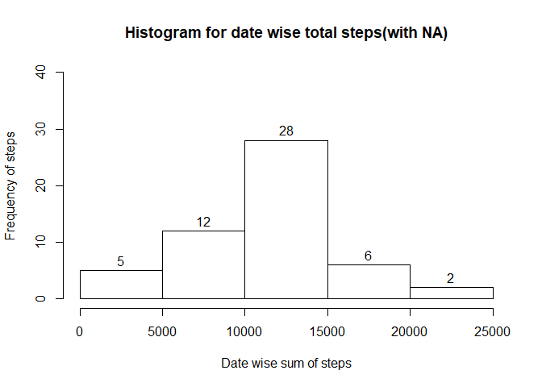
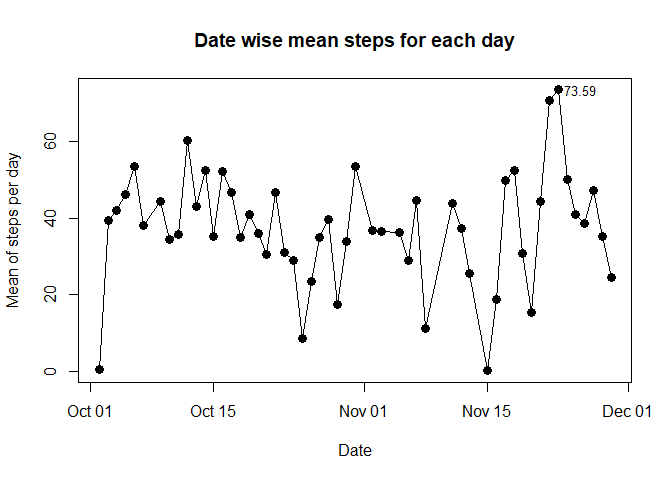
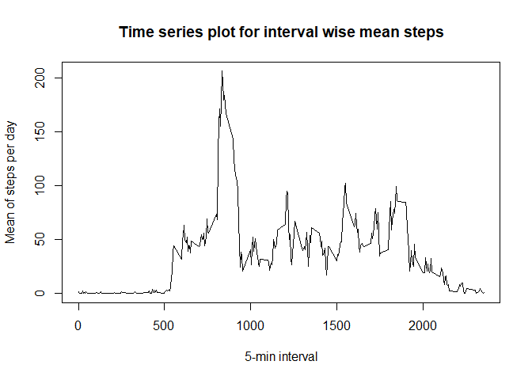
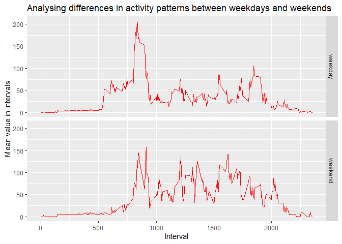

Loading and preprocessing the data
----------------------------------

    library(plyr)
    library(dplyr)
    library(ggplot2)
    library(ggrepel)
    library(knitr)
    unzip("activity.zip")
    activity<-read.csv("activity.csv",header = T)
    activity$date<-as.Date(as.character(activity$date),"%Y-%m-%d")
    activity<-mutate(activity,weekday = weekdays(date))
    head(activity)

    ##   steps       date interval weekday
    ## 1    NA 2012-10-01        0  Monday
    ## 2    NA 2012-10-01        5  Monday
    ## 3    NA 2012-10-01       10  Monday
    ## 4    NA 2012-10-01       15  Monday
    ## 5    NA 2012-10-01       20  Monday
    ## 6    NA 2012-10-01       25  Monday

    str(activity)

    ## 'data.frame':    17568 obs. of  4 variables:
    ##  $ steps   : int  NA NA NA NA NA NA NA NA NA NA ...
    ##  $ date    : Date, format: "2012-10-01" "2012-10-01" ...
    ##  $ interval: int  0 5 10 15 20 25 30 35 40 45 ...
    ##  $ weekday : chr  "Monday" "Monday" "Monday" "Monday" ...

What is mean total number of steps taken per day?
-------------------------------------------------

Here I have used dplyr package for grouping and summarizing steps
datewise.Then I have taken only those rows which does not have NA and
finally I have calculated mean and median using mean() and median()
function.

    activity_sum_mean_median<-activity%>%group_by(date)%>%summarise(date_wise_sum=sum(steps,na.rm = T),date_wise_mean=mean(steps,na.rm = T),date_wise_median=median(steps,na.rm = T))
    activity_tibble_nona<-activity_sum_mean_median[complete.cases(activity_sum_mean_median),]
    mean(activity_tibble_nona$date_wise_sum,na.rm = T)

    ## [1] 10766.19

    median(activity_tibble_nona$date_wise_sum,na.rm = T)

    ## [1] 10765

What is the average daily activity pattern?
-------------------------------------------

The average daily pattern can be visualised by analysing several plots:-

1.Histogram for date wise total steps(with NA):-

    hist(activity_tibble_nona$date_wise_sum,xlab="Date wise sum of steps",ylab = "Frequency of steps",ylim = c(0,40),labels = T,main = "Histogram for date wise total steps(with NA)")

2.Date wise mean steps for each day with the maximum average steps
mentioned on the plot

    with(activity_tibble_nona,plot(date,date_wise_mean,type="o",pch=19,cex=1.3,xlab="Date",ylab = "Mean of steps per day"))
    max_mean<-which.max(activity_tibble_nona$date_wise_mean)
    text(x=activity_tibble_nona$date[max_mean],y=activity_tibble_nona$date_wise_mean[max_mean],labels =round(activity_tibble_nona$date_wise_mean[max_mean],2),cex = 0.8,adj = -0.2)
    title("Date wise mean steps for each day")

3.A time series plot of the 5-minute interval (x-axis) and the average
number of steps taken, averaged across all days (y-axis)

    activity1<-activity%>%group_by(interval)%>%summarize(interval_wise_mean=mean(steps,na.rm = T),interval_wise_sum=sum(steps,na.rm = T))
    activity1

    ## # A tibble: 288 x 3
    ##    interval interval_wise_mean interval_wise_sum
    ##       <int>              <dbl>             <int>
    ##  1        0             1.72                  91
    ##  2        5             0.340                 18
    ##  3       10             0.132                  7
    ##  4       15             0.151                  8
    ##  5       20             0.0755                 4
    ##  6       25             2.09                 111
    ##  7       30             0.528                 28
    ##  8       35             0.868                 46
    ##  9       40             0                      0
    ## 10       45             1.47                  78
    ## # ... with 278 more rows

    plot(activity1$interval,activity1$interval_wise_mean,type="l",pch=19,cex=0.8,xlab="5-min interval",ylab = "Mean of steps per day")
    title("Time series plot for interval wise mean steps")

Imputing missing values
-----------------------

Calculatation of total number of missing values in the dataset (i.e. the
total number of rows with NA|NAs):-

    colSums(is.na(activity))         #total NA values in each column  

    ##    steps     date interval  weekday 
    ##     2304        0        0        0

    mean(is.na(activity$steps))*100  #percentage of NA values from overall dataset

    ## [1] 13.11475

First taking all indexes where the NA values exists in the
date\_wise\_mean column in activity\_sum\_mean\_median dataframe.

    na_indexes<-which(is.na(activity_sum_mean_median$date_wise_mean))
    na_indexes

    ## [1]  1  8 32 35 40 41 45 61

Devise a strategy for filling in all of the missing values in the dataset.
--------------------------------------------------------------------------

The stategy that I have used here is as follows:- In the
date\_wise\_mean column in activity\_sum\_mean\_median dataframe,the NA
values are assigned the mean of the values that precedes and succeeds
that particular NA value.For example,suppose NA value in
date\_wise\_mean column is at 8th row so this NA takes the value of mean
of the value at 7th row and value at 9th row. If NA value is at 1st row
then mean of values at next two successor rows is taken and if the last
observation is NA then mean of values at two row that precedes the last
row.

Suppose 1st row is NA then mean of value at 2nd and 3rd row will be
taken and suppose if last row(61 in our case) is NA then mean of value
at 60th and 59th row is taken as subsitute for that NA value.

Suppose that if two NA values occure simoultaneously (in our case at
40th and 41st row),then value at 40 is the mean of value at places 29th
row and 38th row, and the value at 41st place will be the mean of values
at 42nd and 43rd place.

    for(i in 1:nrow(activity_sum_mean_median)){
      if(is.na(activity_sum_mean_median$date_wise_mean[i]) && (i==1||i==41)){
        activity_sum_mean_median$date_wise_mean[i]= mean(c(activity_sum_mean_median$date_wise_mean[i+1],activity_sum_mean_median$date_wise_mean[i+2]))
      }
      else if(is.na(activity_sum_mean_median$date_wise_mean[i]) && (i==61||i==40)){
        activity_sum_mean_median$date_wise_mean[i]= mean(c(activity_sum_mean_median$date_wise_mean[i-1],activity_sum_mean_median$date_wise_mean[i-2]))
      }
      else if(is.na(activity_sum_mean_median$date_wise_mean[i]))
        activity_sum_mean_median$date_wise_mean[i]= mean(c(activity_sum_mean_median$date_wise_mean[i-1],activity_sum_mean_median$date_wise_mean[i+1]))
      else 
        next
      
      }
    activity_sum_mean_median

    ## # A tibble: 61 x 4
    ##    date       date_wise_sum date_wise_mean date_wise_median
    ##    <date>             <int>          <dbl>            <dbl>
    ##  1 2012-10-01             0         19.9                 NA
    ##  2 2012-10-02           126          0.438                0
    ##  3 2012-10-03         11352         39.4                  0
    ##  4 2012-10-04         12116         42.1                  0
    ##  5 2012-10-05         13294         46.2                  0
    ##  6 2012-10-06         15420         53.5                  0
    ##  7 2012-10-07         11015         38.2                  0
    ##  8 2012-10-08             0         41.4                 NA
    ##  9 2012-10-09         12811         44.5                  0
    ## 10 2012-10-10          9900         34.4                  0
    ## # ... with 51 more rows

In the above data frame all the NA values are taken care of and we will
use this mean to generate random numbers in our original dataset to fill
the NA values and then we will use floor() function to convert it to an
integer.

As we can see in our riginal dataset ,almost at all dates first 20-25
rows and last 20-25 rows are having 0 steps so we will do the same to
substitute our NA values.Wherever NA value starts the first 21 rows from
that ith row will take value 0 and last 21 rows will also take value 0
and rest 245 rows will take floor of the random values with mean as the
corrosponding value is the date\_wise\_mean column in
activity\_sum\_mean\_median dataframe.

    set.seed(123)
    activity3<-activity
    j=1
    i=1
    while(i<=nrow(activity3)){
          if(is.na(activity3$steps[i])){
            activity3$steps[i:(i+20)]=0
            activity3$steps[(i+21):(i+266)]=floor(rnorm(245,mean = activity_sum_mean_median$date_wise_mean[na_indexes[j]],sd=4))
            activity3$steps[(i+267):(i+287)]=0
            j=j+1
            
               if(j>length(na_indexes))
                   break
            i=i+288
          }
        else{
          i=i+1
          }
    }
    head(activity3,30)          #1st 21 rows are replaced by 0 as intended

    ##    steps       date interval weekday
    ## 1      0 2012-10-01        0  Monday
    ## 2      0 2012-10-01        5  Monday
    ## 3      0 2012-10-01       10  Monday
    ## 4      0 2012-10-01       15  Monday
    ## 5      0 2012-10-01       20  Monday
    ## 6      0 2012-10-01       25  Monday
    ## 7      0 2012-10-01       30  Monday
    ## 8      0 2012-10-01       35  Monday
    ## 9      0 2012-10-01       40  Monday
    ## 10     0 2012-10-01       45  Monday
    ## 11     0 2012-10-01       50  Monday
    ## 12     0 2012-10-01       55  Monday
    ## 13     0 2012-10-01      100  Monday
    ## 14     0 2012-10-01      105  Monday
    ## 15     0 2012-10-01      110  Monday
    ## 16     0 2012-10-01      115  Monday
    ## 17     0 2012-10-01      120  Monday
    ## 18     0 2012-10-01      125  Monday
    ## 19     0 2012-10-01      130  Monday
    ## 20     0 2012-10-01      135  Monday
    ## 21     0 2012-10-01      140  Monday
    ## 22    17 2012-10-01      145  Monday
    ## 23    19 2012-10-01      150  Monday
    ## 24    26 2012-10-01      155  Monday
    ## 25    20 2012-10-01      200  Monday
    ## 26    20 2012-10-01      205  Monday
    ## 27    26 2012-10-01      210  Monday
    ## 28    21 2012-10-01      215  Monday
    ## 29    14 2012-10-01      220  Monday
    ## 30    17 2012-10-01      225  Monday

    activity3[78:100,]          #let's see any random row to see if were successful at what we wanted

    ##     steps       date interval weekday
    ## 78     13 2012-10-01      625  Monday
    ## 79     22 2012-10-01      630  Monday
    ## 80     20 2012-10-01      635  Monday
    ## 81     20 2012-10-01      640  Monday
    ## 82     21 2012-10-01      645  Monday
    ## 83     17 2012-10-01      650  Monday
    ## 84     18 2012-10-01      655  Monday
    ## 85     15 2012-10-01      700  Monday
    ## 86     15 2012-10-01      705  Monday
    ## 87     21 2012-10-01      710  Monday
    ## 88     21 2012-10-01      715  Monday
    ## 89     20 2012-10-01      720  Monday
    ## 90     23 2012-10-01      725  Monday
    ## 91     28 2012-10-01      730  Monday
    ## 92     17 2012-10-01      735  Monday
    ## 93     10 2012-10-01      740  Monday
    ## 94     23 2012-10-01      745  Monday
    ## 95     17 2012-10-01      750  Monday
    ## 96     17 2012-10-01      755  Monday
    ## 97     24 2012-10-01      800  Monday
    ## 98     18 2012-10-01      805  Monday
    ## 99     15 2012-10-01      810  Monday
    ## 100    20 2012-10-01      815  Monday

    colSums(is.na(activity3))   #we can see all nas has been replaced

    ##    steps     date interval  weekday 
    ##        0        0        0        0

Are there differences in activity patterns between weekdays and weekends?
-------------------------------------------------------------------------

Let’s create a new dataframe with one extra column for weekday or
weekend and plot panels for analysing behaviour on weekdays and weekend.

    activity4<-mutate(activity3,weekday_or_weekend=ifelse(weekday=="Saturday","weekend",ifelse(weekday=="Sunday","weekend","weekday")))
    head(activity4)

    ##   steps       date interval weekday weekday_or_weekend
    ## 1     0 2012-10-01        0  Monday            weekday
    ## 2     0 2012-10-01        5  Monday            weekday
    ## 3     0 2012-10-01       10  Monday            weekday
    ## 4     0 2012-10-01       15  Monday            weekday
    ## 5     0 2012-10-01       20  Monday            weekday
    ## 6     0 2012-10-01       25  Monday            weekday

    activity4_total<-activity4%>%group_by(interval,weekday_or_weekend)%>%summarize(interval_wise_mean=mean(steps))
    activity4_total

    ## # A tibble: 576 x 3
    ## # Groups:   interval [288]
    ##    interval weekday_or_weekend interval_wise_mean
    ##       <int> <chr>                           <dbl>
    ##  1        0 weekday                        2.02  
    ##  2        0 weekend                        0     
    ##  3        5 weekday                        0.4   
    ##  4        5 weekend                        0     
    ##  5       10 weekday                        0.156 
    ##  6       10 weekend                        0     
    ##  7       15 weekday                        0.178 
    ##  8       15 weekend                        0     
    ##  9       20 weekday                        0.0889
    ## 10       20 weekend                        0     
    ## # ... with 566 more rows

    g<-ggplot(activity4_total,aes(interval,interval_wise_mean))+geom_line(color="red")+facet_grid(weekday_or_weekend~.)+labs(x="Interval",y="Mean value in intervals")+ggtitle("Analysing differences in activity patterns between weekdays and weekends")
    g

From the plot at weekends the interval of 1000-2000 has a rise as
compared to weekdays, and for 0-1000 interval steps taken on weekdays
exceeds weekends.
